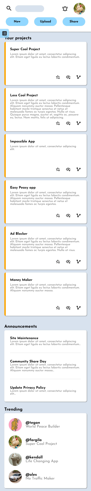
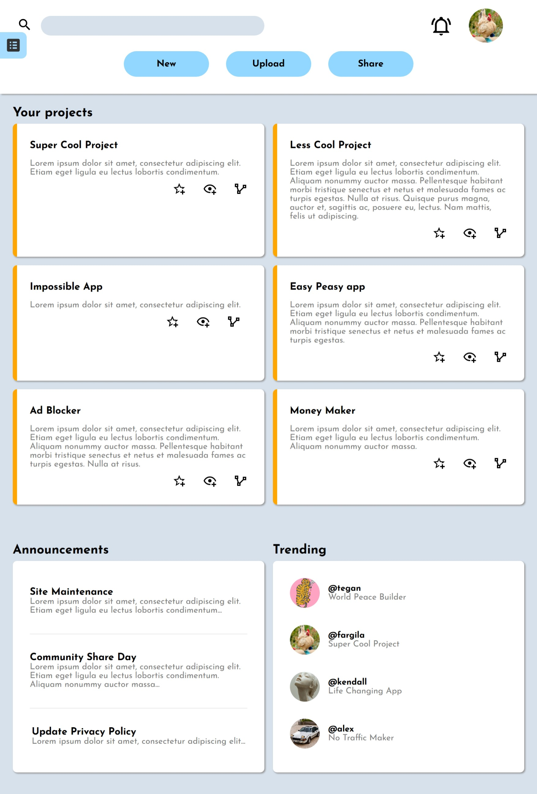
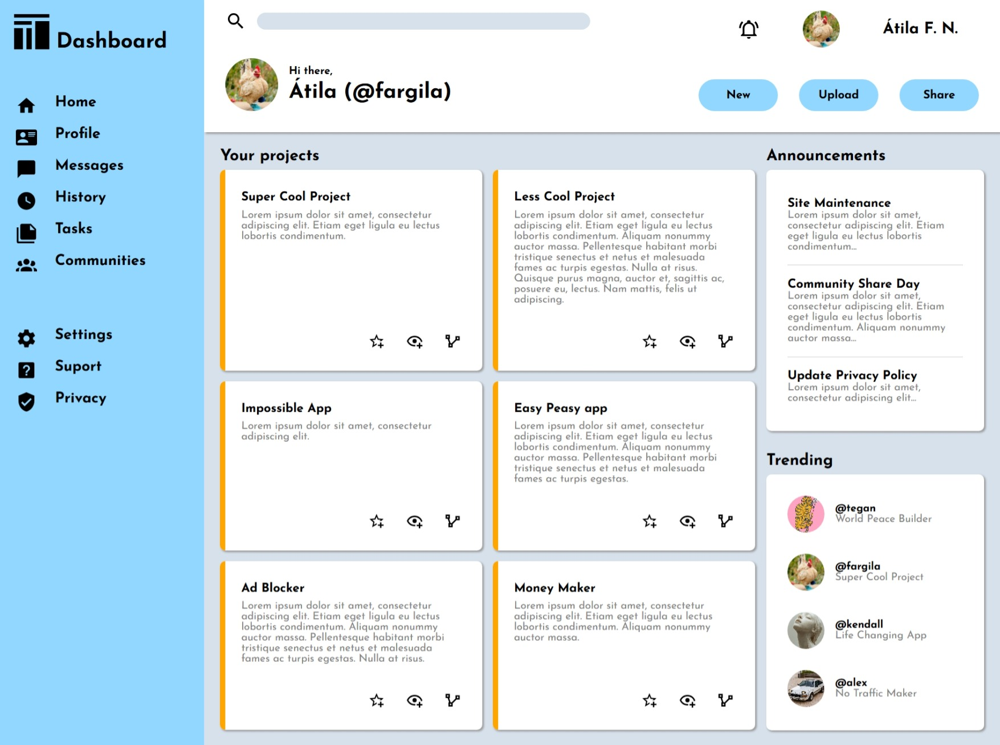

# 📊 Admin Dashboard — The Second Odin Project

Welcome to the **Admin Dashboard**, a responsive web interface built as part of [The Odin Project](https://www.theodinproject.com/) curriculum. This project demonstrates a clean, modern layout using HTML and CSS, with no JavaScript required.

## 🚀 Getting Started

1. Clone the repository:
   ```bash
   git clone https://github.com/fargila/The-Second-Odin-Project-Admin-Dashboard.git

## 🧰 Features

- **Responsive Design**: Adapts seamlessly across three device types:
  - 📱 **Phone View**: Simplified layout with stacked sections and touch-friendly spacing.
  - 📱📲 **Tablet View**: Balanced grid layout with moderate spacing and sidebar access.
  - 🖥️ **Desktop View**: Full-featured dashboard with multi-column layout and expanded sidebar.
- **Sidebar Navigation**: Quick access to sections like Home, Profile, Messages, History, Tasks, Communities, Settings, Support, and Privacy.
- **User Panel**: Displays user greeting and avatar (e.g., “Hi there, Átila (@fargila)”).
- **Project Showcase**: Includes cards for projects like “Super Cool Project,” “Impossible App,” “Ad Blocker,” and more.
- **Announcements Section**: Highlights site updates, community events, and policy changes.
- **Trending Panel**: Displays popular users and projects in the community.

## 📱 View Modes

### 📱 Phones


### 📱 Tablets


### 📱 Personal Computers


## 🛠️ Tech Stack

- **HTML5**
- **CSS3**
- **Flexbox**
- **Media Queries**

## 🙌 Acknowledgments

Thanks to [The Odin Project](https://www.theodinproject.com/) for providing this learning path.
